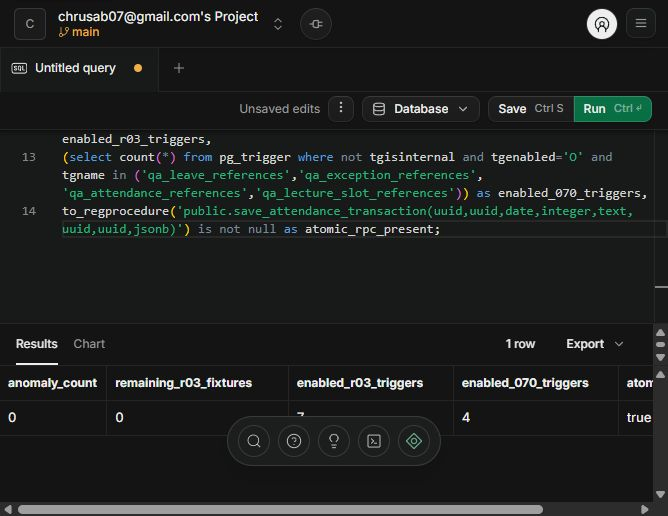

# R-03: historical ownership reassignment

## Inspection before implementation

- `students.section_id` can be changed through the Admin student form and a direct authenticated Admin update. CR updates are constrained by section RLS. Existing attendance/leave checks run on child writes, so changing the student alone bypasses them.
- `subjects.academic_group_id` can be changed by authenticated Admin through the database API. The subject form sends the active group in a hidden field. Existing timetable/lecture validation runs only on those child tables, not on a subject update.
- `sections.academic_group_id` can be changed by authenticated Admin through the database API; there is no section-edit form or section CRUD method in this checkout. Changing it can invalidate timetable/lecture subject-group relationships.
- `attendance` references a student and lecture. `student_leaves` references a student and section. `timetable` and `lectures` reference a subject and section. Slot-linked exceptions inherit their subject through timetable; slotless exceptions have only section ownership. Students, settings, profiles and leaves do not store an independent academic-group foreign key. Therefore their presence alone need not prevent a section group change; valid attendance history is already covered by the section's lecture dependencies.
- Settings edits change section settings, not section ownership. Profile edits expose name/password only. Timetable and attendance flows use section/subject IDs and existing child validators.
- Migrations 040, 050, 060 and the working-tree 070 were inspected. This checkout has no migration 080 and its production save methods still perform separate writes. The user's reported deployed 080 must be checked on the test database; R-03 will not modify or reconstruct earlier migrations or attendance-save logic.
- Pre-existing uncommitted edits: `supabase/migrations/20261002070000_qa_integrity_guards.sql` and `supabase/diagnostics/qa-integrity.sql`. Preserve both.

## Checkout reconciliation

During implementation, external Drive sync introduced the verified R-01 migration 080, RPC callers and three tests while replacing the committed R-02 files with older copies. The user paused sync and explicitly requested preservation of R-01 and restoration of committed R-02. R-02 was restored from commit `966f558`; R-01 edits and all prior migration files were retained. Only R-03 changes are staged for this task's commit. The three R-01 tests and RPC changes remain in the working tree as unrelated changes.

## Final policy and migration

Applied `supabase/migrations/20261002090000_guard_historical_reassignment.sql` to disposable Supabase project `qsczhptvebegufasmtmz` on 2026-10-03.

- A student's section change fails with SQLSTATE `23514` if any attendance lecture or leave record belongs to a different section than the proposed target. Pending, approved and rejected leave records all count. No conflicting dependencies means the change is allowed.
- A subject's group change fails with `23514` whenever any timetable or lecture references the subject, including inactive timetable rows. An unused subject can move subject to existing FK/uniqueness rules.
- A section's group change fails with `23514` if a linked timetable/lecture subject would belong to a different group. Empty sections can move. Students, leaves, settings, profiles and slotless breaks do not independently block a safe move because they have no separate group key. Slot-linked exceptions and valid historical attendance are covered by timetable/lecture dependencies.
- Only changed ownership values invoke these guards. Names, codes, contacts and reassigning the same existing ownership value still work. No historical rows are rewritten or transferred.
- Checks are SECURITY DEFINER with a fixed search path so RLS cannot hide dependencies; there is no Admin exception. Direct execution is revoked from API roles. Existing RLS and 040/070/080 functions are preserved.
- Child writes acquire parent `FOR SHARE` locks before existing reference validators. Ownership changes require READ COMMITTED (or PostgreSQL's equivalent READ UNCOMMITTED), rejecting fixed-snapshot transactions with an actionable `23514` message. This avoids a stale dependency scan after a concurrent insert commits. Ordinary edits work at other isolation levels. See [PostgreSQL row-lock compatibility](https://www.postgresql.org/docs/current/explicit-locking.html#LOCKING-ROWS) and [transaction isolation](https://www.postgresql.org/docs/current/transaction-iso.html).

## Database verification

The Supabase SQL Editor ran direct SQL with `SET LOCAL ROLE authenticated` and synthetic Admin/CR JWT claim subjects. These identities had temporary `auth.users` and profile rows; no passwords or persistent credentials were created. The test transaction rolled back all fixtures, successful edits and test helper functions.

27 checks passed, 0 failed, both on the live disposable Supabase database and locally using PostgreSQL/WASM (PGlite 0.5.8):

| Check | Result |
| --- | --- |
| Student with attendance: A to B | Rejected, `23514`; A and all rows unchanged |
| Student with no dependencies: A to B | Allowed |
| Student with leave dependency | Rejected, `23514` |
| Subject referenced by timetable only / lecture only | Both rejected, `23514` |
| Unused subject: G1 to G2 | Allowed |
| Section with timetable/history / lecture only | Both rejected, `23514` |
| Empty section: G1 to G2 | Allowed |
| Section with independent students/leaves/settings/slotless break | Allowed; dependent rows unchanged |
| Normal student/subject/section edits; same ownership value | Allowed |
| Admin identity and all invalid reassignment attempts | Authenticated Admin confirmed; all rejected |
| CR transfer of dependency-free student | RLS rejection, `42501` |
| CR subject/section reassignment and foreign student update | Zero rows modified |
| 070 attendance, leave, exception ownership | All rejected invalid writes |
| 070 inactive CR access | Access denied |
| 080 valid atomic save / invalid edit | Valid save succeeds; invalid edit changes no rows |

The migration deployment compared fingerprints of all 11 business tables and all pre-existing public functions before/after: unchanged. Failed Admin moves compared full JSON snapshots of every business row: unchanged. Safe moves and ordinary edits also left lectures, attendance, timetable, leaves and exceptions unchanged.

Pre-migration anomaly count: **0**. Post-test SELECT-only diagnostics: **0**. Remaining R-03 synthetic rows across auth and all business tables: **0**. All **7** new triggers and **4** existing 070 reference triggers are enabled; the 080 RPC remains present and was exercised successfully.

Reproduce database tests with `tests/r03-database.sql` in the disposable Supabase SQL Editor as postgres. It switches to the authenticated roles for the actual tests and ends with ROLLBACK. The companion `tests/run-r03-db.cjs` loads the repository schema/migrations into PGlite and executes the same SQL; it requires the existing 080 migration and an external `@electric-sql/pglite` installation (`PGLITE_MODULE_PATH` may point to its `dist/index.cjs`). No dependency was added to the application.

## Frontend and regression verification

- Student section options with known conflicts are disabled with an explanation. The DB error still displays through the existing toast when a reassignment is attempted using stale or bypassed UI state.
- Subject edits preserve the subject's existing group instead of deriving it from a potentially changed active filter.
- Demo mutation guards mirror student/subject database errors before touching in-memory state. No section editor or new transfer workflow was added.
- `node --experimental-vm-modules --test tests/qa.test.cjs`: **32 passed, 0 failed** in the reconciled working tree: all 22 committed baseline tests, 3 preserved synced R-01 tests, and 7 new R-03 tests. No baseline test was removed or weakened.
- The exact staged R-03 commit was also tested in a temporary index snapshot: **29 passed, 0 failed** (22 baseline + 7 R-03). The difference is the three separately preserved, unstaged R-01 tests.
- Database tests cover section reassignment directly; the frontend has no section ownership mutation method to test.

## Files in the R-03 change

- `supabase/migrations/20261002090000_guard_historical_reassignment.sql`
- `supabase/diagnostics/historical-reassignment.sql`
- `js/ownership-guards.js`
- `js/students.js`
- `js/subjects.js`
- R-03 hunks only in `js/supabase.js` and `tests/qa.test.cjs`
- `tests/r03-database.sql`
- `tests/run-r03-db.cjs`
- `qa/R-03-VERIFICATION.md`
- `qa/evidence/r03-database-status.png`

Commit message: `Guard historical ownership changes`.

Remaining R-03 limitation: concurrent multi-session stress was not run; parent/child locking and the fixed-snapshot restriction are implemented. Direct Admin tests used the actual authenticated database role with JWT claims through the SQL Editor, not a separate HTTP login. All requested ownership cases passed on the live database. R-04 onward remain outside scope.

R-03 VERIFIED FIXED
